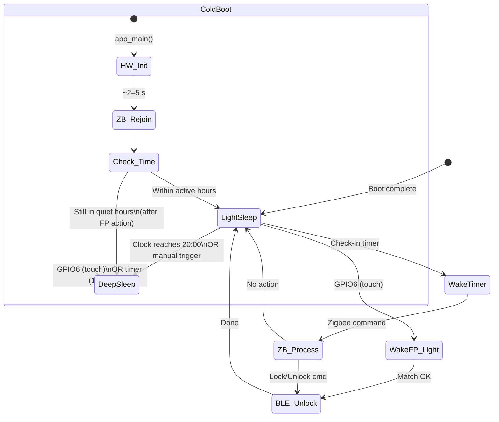

# Deep Sleep Mode Concept — Smart Door Finger (SDF)

## 1. Motivation

The device is typically unused between **20:00** and **11:00** (15 hours/day).
During these quiet hours, the current light-sleep baseline (~180 µA) can be
reduced to **~7–14 µA** by switching to ESP32-C6 deep sleep, saving roughly
**~2.5 mAh/night** and extending battery life significantly.

The fingerprint sensor remains the only required wake source during quiet
hours — if the user touches the sensor, the device should still unlock the
door. Zigbee remote commands are **not available** during deep sleep.

---

## 2. Light Sleep vs. Deep Sleep Comparison

| Property | Light Sleep | Deep Sleep |
|----------|-----------|-----------|
| **Current draw** | ~180 µA (measured) | ~7–14 µA |
| **RAM retention** | ✅ Full SRAM preserved | ❌ All SRAM lost |
| **CPU state** | Paused, resumes in place | Full reboot (`app_main`) |
| **FreeRTOS state** | Preserved (tasks, queues, semaphores) | Lost — must re-create |
| **Zigbee stack** | Maintained, polls parent on wake | Lost — full re-init + rejoin |
| **BLE (NimBLE)** | Gated but host state preserved | Lost — full host restart |
| **NVS data** | Accessible immediately | Accessible after flash init |
| **Wake sources** | Timer, any GPIO, UART, BT/WiFi MAC | Timer, RTC GPIOs only (GPIO0–7) |
| **Wake latency** | < 1 ms | ~5–20 ms (boot + RC calibration) |
| **Fingerprint GPIO6** | ✅ Supported | ✅ Supported (RTC GPIO) |

---

## 3. Proposed Dual-Mode Architecture

```
          ┌─────────────────────────────────────────────────────┐
          │                    ACTIVE HOURS                      │
          │              11:00 ─────── 20:00                     │
          │                                                     │
          │   ┌─ Light Sleep (current behavior) ──────────┐     │
          │   │ • Zigbee polling every 15 s                │     │
          │   │ • Fingerprint GPIO wake                    │     │
          │   │ • BLE radio gated                          │     │
          │   │ • Full state preservation                  │     │
          │   └───────────────────────────────────────────┘     │
          │                        │                            │
          │                   20:00 trigger                     │
          │                        ▼                            │
          │   ┌─ Deep Sleep (new) ────────────────────────┐     │
          │   │ • NO Zigbee polling                        │     │
          │   │ • Fingerprint GPIO6 wake only              │     │
          │   │ • ~7–14 µA                                 │     │
          │   │ • Full reboot on wake                      │     │
          │   └───────────────────────────────────────────┘     │
          │                        │                            │
          │                   11:00 timer                       │
          │                   or GPIO6 touch                    │
          │                        ▼                            │
          │              Return to Light Sleep mode             │
          └─────────────────────────────────────────────────────┘
```

### 3.1 State Transitions



---

## 4. Limitations & Constraints

### 4.1 Zigbee Unavailability During Deep Sleep

> [!CAUTION]
> **Zigbee remote commands (lock/unlock/enrollment) are NOT available during
> deep sleep.** The Zigbee network connection is fully torn down.

- The Zigbee parent router will buffer pending commands, but only for the
  duration of its **parent timeout** (typically 3–5 check-in intervals).
  After that, buffered commands are dropped.
- When the device enters deep sleep for 15 hours, the parent will mark it as
  **timed out** and stop buffering. Commands sent during the deep-sleep window
  are silently lost.
- On wake, the device must do a full **Zigbee stack re-init + network rejoin**
  (`ESP_ZB_BDB_SIGNAL_DEVICE_REBOOT` path). This takes **~2–5 seconds** and
  requires the coordinator to be reachable.

**Impact:** The home automation system **cannot open the door remotely** during
quiet hours. This is acceptable for the stated use case (nobody is expected
to use the system remotely at night), but should be clearly communicated.

### 4.2 Full Reboot on Wake — Cold Start Penalty

Deep sleep wake is equivalent to a **hardware reset**. All RAM, FreeRTOS
tasks, queues, and semaphores are lost. The device executes `app_main()` from
scratch.

| Init Phase | Duration (estimated) | Description |
|------------|---------------------|-------------|
| ROM boot + flash init | ~50 ms | Hardware startup |
| NVS init | ~30 ms | Read Nuki keys, config |
| FreeRTOS task creation | ~10 ms | All tasks re-created |
| Zigbee stack init + rejoin | **2–5 s** | Network steering or rejoin |
| BLE NimBLE host start | ~200 ms | Controller + host init |
| Fingerprint sensor boot | 200 ms | GPIO7 HIGH + UART ready |
| **Total cold-start** | **~3–6 s** | Before ready to act |

**Impact on fingerprint unlock latency:**
- Current light-sleep path: touch → unlock in **~1.8 s**
- Deep-sleep path: touch → unlock in **~5–8 s** (includes Zigbee rejoin
  before BLE action can proceed)

> [!IMPORTANT]
> The Zigbee rejoin can be **deferred** if the wake reason is fingerprint.
> The device can skip Zigbee init during quiet hours and go straight to
> BLE unlock, reducing the fingerprint path to **~1.5 s**. Zigbee rejoin
> then happens after the unlock is complete (or is skipped entirely if the
> device re-enters deep sleep).

### 4.3 RTC GPIO Constraint

Only **GPIO0–7** are RTC GPIOs on the ESP32-C6 and can wake from deep sleep.

| GPIO | Current Use | Deep-Sleep Wake? |
|------|-----------|-----------------|
| GPIO6 | Fingerprint WAKE | ✅ Yes — RTC GPIO |
| GPIO7 | Fingerprint EN (power) | N/A (output, not wake) |
| GPIO9 | BOOT / Enrollment button | ❌ Not RTC GPIO |

GPIO6 is an RTC GPIO, so the fingerprint capacitive touch wake works in deep
sleep. However, the **enrollment button (GPIO9) cannot wake from deep sleep**
since it is not an RTC GPIO.

### 4.4 Fingerprint Sensor Power Sequencing

The fingerprint sensor is powered off during any sleep (GPIO7 LOW). In deep
sleep, the sensor's capacitive touch detection circuit still functions on its
own standby power (~5 µA from its internal regulator), driving GPIO6 HIGH on
touch.

After deep-sleep wake:
1. GPIO7 must be driven HIGH (sensor power on)
2. 200 ms UART boot delay
3. Match query over UART

This is the same as the light-sleep path — no additional constraints.

### 4.5 BLE State Loss

The NimBLE host state (connection cache, GATT discovery cache) is lost. The
Nuki pairing keys are persisted in **NVS** and survive deep sleep, so
re-pairing is NOT required. However:

- The BLE controller must be fully re-initialized
- The NimBLE host task must be re-spawned via `nimble_port_freertos_init()`
- GATT service discovery runs on each connection (already the case today)

**Impact:** Adds ~200 ms to the BLE path. Acceptable.

### 4.6 Timekeeping

The ESP32-C6 **RTC timer** survives deep sleep and maintains time with
reasonable accuracy (~5% drift on the internal RC oscillator). This is used to:

- Set a timer wakeup for the end of the quiet window (e.g., 11:00)
- Determine whether to re-enter deep sleep or switch to light sleep after
  a fingerprint wake

> [!WARNING]
> **The ESP32-C6 has no real-time clock (RTC) with calendar.** The system
> only has a monotonic microsecond counter (`esp_timer_get_time()`). To
> implement time-of-day scheduling, the firmware needs either:
> - A **Zigbee time sync** from the coordinator (e.g., ZCL Time cluster) before entering deep sleep, or
> - An **NTP sync** (requires Wi-Fi, which is disabled), or
> - A **configurable duration** (e.g., "sleep for 15 hours") rather than wall-clock times.
>
> The simplest approach for v1 is **duration-based**: configure quiet hours
> as a sleep duration after the last activity past a threshold time.

### 4.7 Power Budget Comparison

Assumptions: 3.7 V / 1000 mAh LiPo, 10 FP unlocks/day, 2 Zigbee unlocks/day
(only during active hours), 15 s check-in.

| Category | Light Sleep Only | With Deep Sleep (15 h/day) |
|----------|-----------------|---------------------------|
| Sleep baseline (9 h active) | 0.48 mAh/day | 0.04 mAh (9 h × 180 µA) |
| Deep sleep baseline (15 h quiet) | — | 0.002 mAh (15 h × 14 µA) |
| Timer wakes (active hours only) | 0.72 mAh/day | 0.27 mAh (9 h only) |
| Fingerprint unlocks | 0.40 mAh/day | 0.40 mAh (slightly longer cold start) |
| Zigbee remote unlocks | 0.09 mAh/day | 0.09 mAh (active hours only) |
| Battery reports | 0.12 mAh/day | 0.05 mAh (9 h only) |
| Cold boot from deep sleep | — | 0.03 mAh (1×/day, 5 s @ 80 mA) |
| **Daily total** | **~1.81 mAh** | **~0.88 mAh** |
| **Estimated battery life** | **~553 days** | **~1136 days (~3 years)** |

> [!NOTE]
> Conservative real-world estimate with deep sleep: **12–24 months**
> (accounting for LDO losses, self-discharge, and BLE retries).

---

## 5. Implementation Approach

### 5.1 New Configuration Knobs

| Config Key | Default | Description |
|------------|---------|-------------|
| `CONFIG_SDF_POWER_DEEP_SLEEP_ENABLE` | `n` | Master switch for deep sleep mode |
| `CONFIG_SDF_POWER_QUIET_DURATION_HOURS` | `15` | Duration of deep sleep window |
| `CONFIG_SDF_POWER_QUIET_IDLE_THRESHOLD_MIN` | `30` | Enter deep sleep after N min of inactivity past 20:00 |

### 5.2 RTC Memory Usage

A small struct is stored in RTC FAST memory (`RTC_DATA_ATTR`) to survive
deep sleep and communicate state across reboots:

```c
typedef struct {
    uint32_t magic;              // Validation marker
    int64_t  deep_sleep_enter_us;// Monotonic time when deep sleep started
    int64_t  quiet_end_us;       // Monotonic time when quiet window ends
    uint8_t  wake_count;         // Number of deep-sleep wakes this window
    bool     zigbee_defer;       // Skip Zigbee init on fingerprint wake
} __attribute__((packed)) sdf_deep_sleep_rtc_t;

RTC_DATA_ATTR static sdf_deep_sleep_rtc_t s_ds_rtc;
```

### 5.3 Deep Sleep Entry Flow

```
sdf_power_task detects:
  ├─ deep_sleep_enable == true
  ├─ inactivity > quiet_idle_threshold
  └─ current time past configured quiet start
        │
        ▼
  Save state to RTC memory (s_ds_rtc)
  GPIO7 = LOW (fingerprint power off)
  Disable all radios
  Configure RTC wake sources:
    ├─ esp_deep_sleep_enable_gpio_wakeup(BIT(6), HIGH)  // GPIO6 touch
    └─ esp_sleep_enable_timer_wakeup(remaining_quiet_us) // end of window
  esp_deep_sleep_start()
```

### 5.4 Deep Sleep Wake Flow

```
app_main() executes (full reboot)
  │
  ├─ Check esp_sleep_get_wakeup_cause()
  │   ├─ ESP_SLEEP_WAKEUP_GPIO → Fingerprint touch
  │   │   ├─ Read s_ds_rtc from RTC memory
  │   │   ├─ GPIO7 = HIGH, wait 200 ms
  │   │   ├─ UART match query
  │   │   ├─ Init BLE only (skip Zigbee for speed)
  │   │   ├─ BLE unlock
  │   │   ├─ Check: still in quiet hours?
  │   │   │   ├─ YES → re-enter deep sleep
  │   │   │   └─ NO  → init Zigbee, switch to light sleep
  │   │   └─ done
  │   │
  │   └─ ESP_SLEEP_WAKEUP_TIMER → Quiet window ended
  │       ├─ Normal full init (Zigbee + BLE + FP)
  │       └─ Switch to light-sleep mode
  │
  └─ ESP_SLEEP_WAKEUP_UNDEFINED → Normal power-on boot
      └─ Normal full init
```

---

## 6. Summary of Constraints

| Constraint | Severity | Workaround |
|-----------|----------|-----------|
| No Zigbee commands during deep sleep | **High** | Accept for quiet hours; document for user |
| Full reboot on wake (~3–6 s) | Medium | Defer Zigbee init on FP wake to keep latency ~1.5 s |
| Enrollment button (GPIO9) can't wake | Low | Enrollment only during active hours |
| No wall-clock time without sync | Medium | Use duration-based quiet window (not clock-based) |
| RTC timer drift (~5%) over 15 h | Low | ±45 min over 15 h; re-sync on Zigbee rejoin |
| Zigbee parent timeout during deep sleep | Medium | Parent will drop the device; rejoin needed |
| NimBLE full re-init on wake | Low | ~200 ms added; Nuki keys persist in NVS |

---

## 7. Recommendations

1. **Start with duration-based quiet mode** — "sleep for 15 hours after 30
   minutes of inactivity past 20:00" — rather than true clock-scheduled
   mode. This avoids the need for time synchronization.

2. **Defer Zigbee init on fingerprint wake during quiet hours** to keep the
   unlock latency close to the light-sleep baseline (~1.5 s vs ~5 s).

3. **Add a Zigbee attribute** to report deep-sleep mode status to the home
   automation system, so the user knows when remote commands are unavailable.

4. **Consider a periodic "heartbeat" wake** during quiet hours (e.g., every
   2 hours) to briefly poll Zigbee. This uses more power (~14 µA → ~17 µA
   average) but prevents the Zigbee parent from fully dropping the device
   and allows urgent commands to get through with ≤ 2 h latency.
