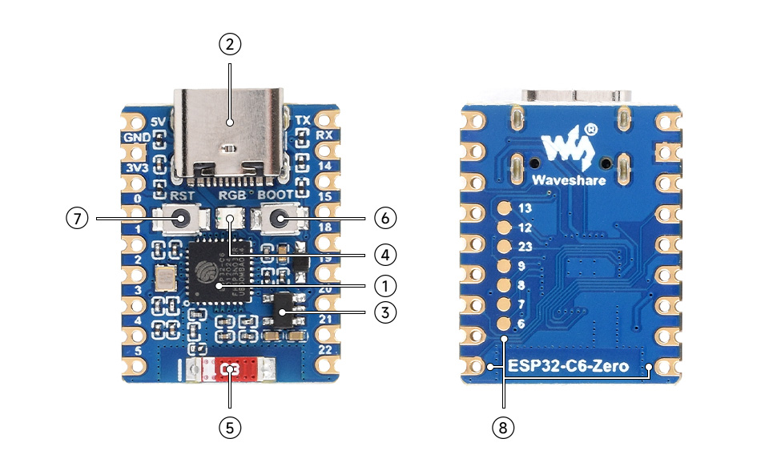
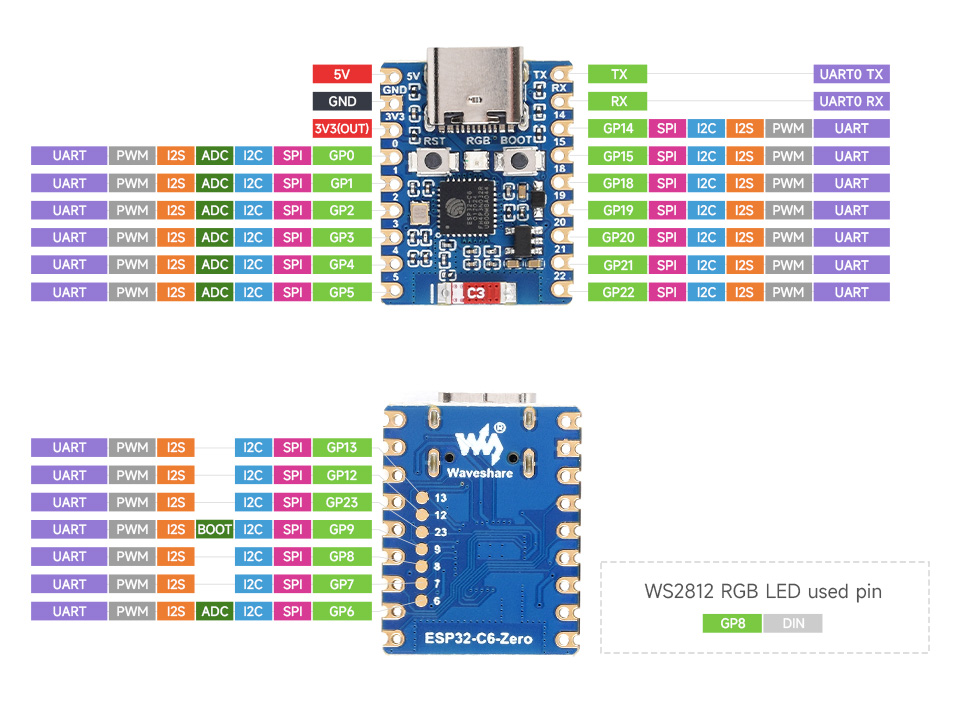

# Hardware Description

## ESP32-C6

In this project the Waveshare ESP32-C6 mini module is used.

### Features
- Adopts ESP32-C6FH4 chip, with RISC-V 32-bit single-core processor, support up to 160 MHz.
- Integrated 320KB ROM, 512KB HP SRAM, 16KB LP SRAM and 4MB Flash memory.
- Integrated WiFi 6, Bluetooth 5 and IEEE 802.15.4 (Zigbee 3.0 and Thread) wireless communication, with superior RF performance.
- Type-C connector, easier to use.
- Rich peripheral interfaces, better compatibility and expandability.
- Castellated module allows soldering directly to carrier boards.
Support multiple low-power modes, adjustable balance between communication distance, data rate and power consumption to meet the power requirements of various application scenarios.
### Overview

1. ESP32-C6FH8 Built-in dual processors, main frequency is up to 160 MHz
2. USB Type-C Port for downloading programme and debugging
3. ME6217C33M5G low dropout LDO, 800mA (Max)
4. WS2812 RGB LED
5. 2.4G ceramic antenna
6. BOOT button Press it and then press the RESET button to enter download mode
7. RESET button
8. ESP32-C6FH8 pins

### Pinout

The pinout of the ESP32-C6FH8 is shown in the following images:

| Breakout Pin | ESP32-C6 Pin | Description |
| ------------ | ------------ | ----------- |
| 5V | 5V | 5V Power Input |
| GND | GND | Ground |
|3.3V | 3.3V | 3.3V Power (Output) |
| 0 | GPIO0, SPI, I2C, ADC, I2S, PWM, UART |  |
| 1 | GPIO1, SPI, I2C, ADC, I2S, PWM, UART |  |
| 2 | GPIO2, SPI, I2C, ADC, I2S, PWM, UART |  |
| 3 | GPIO3, SPI, I2C, ADC, I2S, PWM, UART |  |
| 4 | GPIO4, SPI, I2C, ADC, I2S, PWM, UART |  |
| 5 | GPIO5, SPI, I2C, ADC, I2S, PWM, UART |  |
| 22 | GPIO22, SPI, I2C, ADC, I2S, PWM, UART |  |
| 21 | GPIO21, SPI, I2C, ADC, I2S, PWM, UART |  |
| 20 | GPIO20, SPI, I2C, ADC, I2S, PWM, UART |  |
| 19 | GPIO19, SPI, I2C, ADC, I2S, PWM, UART |  |
| 18 | GPIO18, SPI, I2C, ADC, I2S, PWM, UART |  |
| 15 | GPIO15, SPI, I2C, ADC, I2S, PWM, UART |  |
| 14 | GPIO14, SPI, I2C, ADC, I2S, PWM, UART |  |
| RX | UART0 RX |  |
| TX | UART0 TX |  |

Buttom:
| Breakout Pin | ESP32-C6 Pin | Description |
| ------------ | ------------ | ----------- |
| 6 | GPIO6, SPI, I2C, ADC, I2S, PWM, UART |  |
| 7 | GPIO7, SPI, I2C, I2S, PWM, UART |  |
| 8 | GPIO8, SPI, I2C, I2S, PWM, UART | WS2812 RGB LED |
| 9 | GPIO9, SPI, I2C, BOOT, I2S, PWM, UART |  |
| 23 | GPIO23, SPI, I2C, I2S, PWM, UART |  |
| 12 | GPIO12, SPI, I2C, I2S, PWM, UART |  |
| 13 | GPIO13, SPI, I2C, I2S, PWM, UART |  |

## Battery Holder

Prepared for 2x AA batteries.
Dimensions: 6,50 cm × 2,30 cm × 3,40 cm

## Fingerprint Sensor

Diameter: 1,92 cm