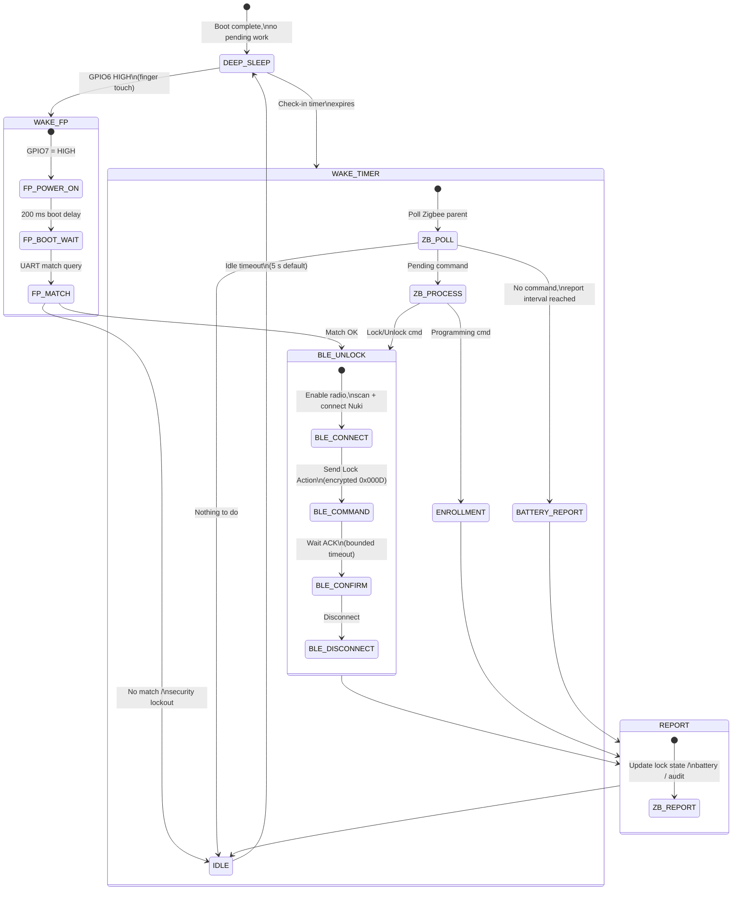

# Power Management Concept — Smart Door Finger (SDF) v2.0

This document describes the power management strategy for the SDF device,
grounded in the two primary use cases and the constraints of the ESP32‑C6
hardware, BLE Nuki communication, and Zigbee sleepy end‑device profile.

---

## 1. Design Goals

| # | Goal | Target |
|---|------|--------|
| G1 | Months of battery life on a single charge/set of cells | ≥ 6 months |
| G2 | Fingerprint‑to‑unlock latency (touch → door opens) | < 3 s |
| G3 | Zigbee command‑to‑unlock latency (coordinator sends → door opens) | ≤ check‑in interval + 3 s |
| G4 | Zero missed Zigbee commands while sleeping | guaranteed by Zigbee parent buffering |
| G5 | Fingerprint sensor kept off during sleep (zero quiescent draw from module) | GPIO7 = LOW |

---

## 2. Hardware Power Domains

The system has four independently gatable power consumers:

```
┌─────────────────────────────────────────────────────┐
│  ESP32-C6 SoC (Waveshare Mini)                      │
│  ┌──────────┐  ┌──────────┐  ┌───────────────────┐  │
│  │ CPU/RAM  │  │ BLE 5    │  │ 802.15.4 (Zigbee) │  │
│  │ (RISC-V) │  │ (NimBLE) │  │ (esp-zigbee-lib)  │  │
│  └──────────┘  └──────────┘  └───────────────────┘  │
└───────┬─────────────┬──────────────┬────────────────┘
        │             │              │
   GPIO6 (Wake)  GPIO7 (EN)    802.15.4 radio
        │             │
┌───────┴─────────────┴──────────────┐
│  UART Fingerprint Sensor           │
│  (capacitive touch + LED ring)     │
│  Power: GPIO7 HIGH = ON, LOW = OFF │
│  Wake:  GPIO6 HIGH on touch        │
└────────────────────────────────────┘
```

| Domain | Active Draw (typ.) | Sleep / Gated Draw | Control |
|--------|-------------------|--------------------|---------|
| ESP32‑C6 CPU | ~25 mA @ 160 MHz | ~20 µA (light sleep) | `esp_light_sleep_start()` |
| BLE radio (NimBLE) | ~60 mA during Tx/Rx | 0 mA (gated) | `sdf_nuki_ble_set_enabled(false)` |
| 802.15.4 radio | ~30 mA during Rx/Tx | ~5 µA (idle/sleep) | Zigbee stack + PM DFS |
| Fingerprint sensor | ~50 mA (matching) | 0 mA (GPIO7 LOW) | `CONFIG_SDF_POWER_FP_EN_GPIO` |

> [!NOTE]
> Current values are approximate and depend on final PCB layout and LDO
> efficiency. They serve as design‑time estimates for the sleep budget.

---

## 3. Power States



---

## 4. Use Case 1 — Fingerprint → BLE Unlock

**Trigger:** User touches the capacitive sensor. The sensor drives GPIO6 HIGH.

### 4.1 Wake Path

| Step | Action | Duration | Power Domain |
|------|--------|----------|-------------|
| 1 | GPIO6 interrupt wakes ESP32‑C6 from light sleep | < 1 ms | CPU |
| 2 | Post‑wake guard starts (1.5 s window prevents re‑sleep) | — | CPU |
| 3 | GPIO7 driven HIGH → fingerprint sensor powers up | instant | FP sensor |
| 4 | Fingerprint boot delay (UART ready) | 200 ms | FP sensor |
| 5 | UART match query sent; sensor returns `User ID` or `NO_MATCH` | ~300 ms | FP sensor |
| 6 | `sdf_power_mark_activity()` resets idle timer | — | — |

### 4.2 BLE Action

| Step | Action | Duration | Power Domain |
|------|--------|----------|-------------|
| 7 | BLE radio re‑enabled (`sdf_nuki_ble_set_enabled(true)`) | < 50 ms | BLE |
| 8 | Scan for Nuki + GAP connect | ~500 ms | BLE |
| 9 | Encrypted challenge + `Lock Action 0x000D UNLOCK` | ~400 ms | BLE |
| 10 | Await status response from Nuki | ~200 ms | BLE |
| 11 | Disconnect; BLE radio gated | < 50 ms | BLE |

### 4.3 Report & Sleep

| Step | Action | Duration | Power Domain |
|------|--------|----------|-------------|
| 12 | Report lock state + audit event over Zigbee | ~100 ms | 802.15.4 |
| 13 | Idle timer begins (5 s) | — | CPU |
| 14 | GPIO7 driven LOW → fingerprint sensor off | — | — |
| 15 | Enter light sleep | — | ~20 µA |

**Total active window:** ~1.8 s (touch to door open), plus 5 s idle tail.

### 4.4 Busy‑Lock Protection

Sleep is vetoed by `sdf_app_power_busy()` while any of the following are true:
- `s_pairing_active` (BLE pairing in progress)
- `s_latch_sequence_active` (unlock + unlatch multi‑step)
- `s_lock_flow.state != IDLE` (encrypted lock action in flight)
- Enrollment state machine active

This prevents the power manager from cutting power mid‑transaction.

---

## 5. Use Case 2 — Zigbee Command → BLE Unlock

**Trigger:** Home automation system (e.g. Home Assistant) sends `Unlock Door`
via the Zigbee coordinator. The command is buffered by the Zigbee parent
router until the SDF polls.

### 5.1 Sleepy End Device Polling

The ESP32‑C6 runs as a **Zigbee Sleepy End Device (ZED)**:
- The Zigbee stack enters its own power save via `CONFIG_PM_ENABLE` +
  `CONFIG_FREERTOS_USE_TICKLESS_IDLE` + `CONFIG_SDF_ZIGBEE_SLEEP_ENABLE`.
- The SDF's power manager wakes the CPU on a configurable **check‑in timer**
  (default 15 s, configurable 1 s … 600 s).
- On timer wake, the Zigbee stack polls its parent for pending frames.

### 5.2 Wake Path

| Step | Action | Duration |
|------|--------|----------|
| 1 | Timer wakeup from light sleep | < 1 ms |
| 2 | BLE radio re‑enabled | < 50 ms |
| 3 | `wake_cb` fires → `sdf_app_power_wakeup` marks activity | — |
| 4 | Zigbee stack polls parent | ~50 ms |
| 5 | Receive buffered `Unlock Door` ZCL command | ~100 ms |

### 5.3 BLE Action

Same as use case 1, steps 7–11 (~1.2 s).

### 5.4 Report & Sleep

Same as use case 1, steps 12–15.

**Worst‑case latency** = check‑in interval (15 s) + active processing (~2 s)
= **17 s** from coordinator send to door open.

### 5.5 Latency vs. Battery Trade‑off

| Check‑in Interval | Worst‑case Latency | Estimated Monthly Wake‑ups | Impact |
|--------------------|--------------------|---------------------------|--------|
| 5 s | 7 s | ~518 400 | High drain, lowest latency |
| **15 s (default)** | **17 s** | **~172 800** | **Balanced** |
| 30 s | 32 s | ~86 400 | Good battery, tolerable delay |
| 60 s | 62 s | ~43 200 | Excellent battery, noticeable delay |

The interval is runtime‑adjustable via `sdf_power_set_checkin_interval_ms()`.

---

## 6. Radio Scheduling & Coexistence

The ESP32‑C6 shares a single 2.4 GHz antenna between BLE and 802.15.4.
The firmware handles this by time‑division:

```
┌─────────────────── Time ──────────────────────────────┐
│ SLEEP │ ZB poll │ BLE session │ ZB report │   SLEEP   │
│ zzzzz │ ◄──50ms│ ◄──1200ms──►│ ◄─100ms─► │ zzzzzzzzz │
└───────┴────────┴─────────────┴───────────┴───────────┘
```

**Rules:**
1. **BLE is gated** during sleep (`enable_ble_radio_gating = true`).
   NimBLE transport is paused before `esp_light_sleep_start()` and resumed
   on wake.
2. **Only one BLE session** at a time (`s_lock_flow` state machine).
3. **Zigbee stack** manages its own low‑power state via ESP‑IDF PM hooks
   (`CONFIG_SDF_ZIGBEE_SLEEP_THRESHOLD_MS = 20`). When no frames are pending,
   the 802.15.4 radio is clock‑gated automatically.
4. **No concurrent BLE + Zigbee Tx.** The Zigbee report is sent only after
   the BLE session is fully disconnected.

---

## 7. Fingerprint Sensor Power Control

The fingerprint module is the single largest peripheral power consumer.
The power management strategy treats it as a **power‑gated peripheral**:

| State | GPIO7 | Sensor State | Draw |
|-------|-------|-------------|------|
| Sleep | LOW | Powered off, no UART, no quiescent draw | 0 mA |
| Wake (touch) | HIGH | Boot → match → respond | ~50 mA for ~500 ms |
| Wake (timer, no enrollment) | LOW | Stays off | 0 mA |
| Enrollment active | HIGH | Kept powered for multi‑touch flow | ~50 mA |

**Key behavior:**
- The sensor itself detects touch capacitively even when the main logic is
  OFF, driving `GPIO6 HIGH` as a wake signal. This is possible because the
  touch detection circuit has minimal quiescent draw (~5 µA).
- After a fingerprint wake and match, `sdf_services` powers the sensor off
  before allowing sleep re‑entry.
- During enrollment, `sdf_app_power_busy()` returns `true`, preventing the
  power manager from cutting sensor power mid‑sequence.

---

## 8. Battery Monitoring & Reporting

| Parameter | Value |
|-----------|-------|
| Report interval | 60 s (`CONFIG_SDF_POWER_BATTERY_REPORT_INTERVAL_MS`) |
| Default percent | 100% (`CONFIG_SDF_POWER_BATTERY_DEFAULT_PERCENT`) |
| Zigbee attribute | Power Configuration cluster, `battery_percent_remaining` |
| ADC source | `battery_cb` callback (app‑provided, reads ADC) |

The battery level is sampled opportunistically during wake periods (no
extra wake‑up is triggered just for battery sampling). The value is pushed
to the Zigbee coordinator via `sdf_protocol_zigbee_update_battery_percent()`.

---

## 9. Sleep Budget Estimate

Assumptions: 3.7 V / 1000 mAh LiPo, 10 fingerprint unlocks per day,
2 Zigbee remote unlocks per day, 15 s check‑in.

| Category | Events/Day | Active per Event | Avg Current | Daily mAh |
|----------|-----------|-----------------|-------------|-----------|
| Light‑sleep baseline | 24 h | — | 20 µA | 0.48 |
| Timer wakes (poll only) | 5 760 | 150 ms | 30 mA | 0.72 |
| Fingerprint unlock | 10 | 1.8 s | 80 mA | 0.40 |
| Zigbee remote unlock | 2 | 2.0 s | 80 mA | 0.09 |
| Battery reports | 1 440 | 100 ms | 30 mA | 0.12 |
| **Total** | | | | **~1.81 mAh/day** |

**Estimated battery life:** 1000 mAh / 1.81 mAh ≈ **553 days (~18 months)**

> [!IMPORTANT]
> This is a theoretical ideal. Real‑world losses (LDO quiescent, BLE
> retries, sensor leakage, self‑discharge) will reduce this. A conservative
> estimate is **6–12 months** depending on usage patterns and battery choice.

---

## 10. Configuration Knobs

All tunable parameters are in `sdkconfig.defaults` and can be changed at
build time or (for the check‑in interval) at runtime:

| Config Key | Default | Unit | Effect |
|------------|---------|------|--------|
| `CONFIG_SDF_POWER_CHECKIN_INTERVAL_MS` | 15 000 | ms | Zigbee poll frequency; latency vs. power |
| `CONFIG_SDF_POWER_IDLE_BEFORE_SLEEP_MS` | 5 000 | ms | How long after last activity before sleep |
| `CONFIG_SDF_POWER_POST_WAKE_GUARD_MS` | 1 500 | ms | Minimum awake time after any wake |
| `CONFIG_SDF_POWER_LOOP_INTERVAL_MS` | 250 | ms | Power task scheduler interval |
| `CONFIG_SDF_POWER_BATTERY_REPORT_INTERVAL_MS` | 60 000 | ms | Battery Zigbee report cadence |
| `CONFIG_SDF_POWER_FP_WAKE_GPIO` | 6 | GPIO | Fingerprint capacitive touch wake |
| `CONFIG_SDF_POWER_FP_EN_GPIO` | 7 | GPIO | Fingerprint sensor power enable |
| `CONFIG_SDF_POWER_ENABLE_LIGHT_SLEEP` | y | bool | Master switch for light sleep |
| `CONFIG_SDF_POWER_ENABLE_BLE_RADIO_GATING` | y | bool | Gate NimBLE during sleep |
| `CONFIG_SDF_ZIGBEE_SLEEP_ENABLE` | y | bool | Let Zigbee stack use PM |
| `CONFIG_SDF_ZIGBEE_SLEEP_THRESHOLD_MS` | 20 | ms | Min idle before Zigbee sleeps |
| `CONFIG_PM_ENABLE` | y | bool | ESP‑IDF power management framework |
| `CONFIG_FREERTOS_USE_TICKLESS_IDLE` | y | bool | FreeRTOS tickless idle integration |

---

## 11. Sequence Diagrams

### 11.1 Use Case 1: Fingerprint → BLE Unlock

```
User          FP Sensor     ESP32-C6        Nuki Lock      ZB Coordinator
 │               │              │               │               │
 │──touch──────►│              │               │               │
 │               │──GPIO6 HI──►│               │               │
 │               │              │ wake from     │               │
 │               │              │ light sleep   │               │
 │               │              │──GPIO7 HI────►│               │
 │               │              │  (power on)   │               │
 │               │              │◄──200ms boot──│               │
 │               │◄──UART match─│               │               │
 │               │──User ID────►│               │               │
 │               │              │──BLE connect─►│               │
 │               │              │──Lock Action──►│               │
 │               │              │◄──ACK─────────│               │
 │               │              │──BLE disconn──│               │
 │               │              │──ZB report───────────────────►│
 │               │              │──GPIO7 LO────►│               │
 │               │              │  (power off)  │               │
 │               │              │ enter light   │               │
 │               │              │ sleep         │               │
```

### 11.2 Use Case 2: Zigbee → BLE Unlock

```
HA App        ZB Coordinator  ESP32-C6        Nuki Lock
 │               │              │               │
 │──Unlock──────►│              │               │
 │               │──buffer cmd──│ (sleeping)    │
 │               │              │               │
 │               │              │ timer wake    │
 │               │              │──ZB poll─────►│
 │               │◄─────────────│               │
 │               │──Unlock cmd─►│               │
 │               │              │──BLE connect─►│
 │               │              │──Lock Action──►│
 │               │              │◄──ACK─────────│
 │               │              │──BLE disconn──│
 │               │              │──ZB report───►│
 │               │              │──────────────►│
 │◄─────────────│              │               │
 │               │              │ enter light   │
 │               │              │ sleep         │
```

---

## 12. Risks & Mitigations

| Risk | Impact | Mitigation |
|------|--------|-----------|
| BLE connect to Nuki takes > 2 s (advertising interval) | Increased active time, higher drain | Bounded timeout with retry limit; `busy_cb` prevents sleep during retries |
| Zigbee parent drops buffered command | Missed remote unlock | Use long parent timeout; check‑in interval shorter than parent buffer TTL |
| Fingerprint sensor leaks current when "off" | Reduces sleep budget | Measure actual quiescent draw; consider MOSFET hard‑cut if > 10 µA |
| ESP32‑C6 light sleep not achieving 20 µA | Sleep budget blown | Profile with current probe; disable debug UART, verify DFS configuration |
| Rapid fingerprint touches cause thrashing | CPU never sleeps | Post‑wake guard (1.5 s) + activity idle timer (5 s) debounce touches |
| Enrollment left open indefinitely | Sensor stays powered, drains battery | Enrollment timeout in state machine; `busy_cb` holds wake only while active |

---

## 13. Future Improvements

- **Adaptive check‑in:** Shorten interval after a Zigbee command is received
  (expecting follow‑up), lengthen during quiet hours.
- **Deep sleep mode:** For extended absence (vacation), fall back to deep
  sleep with only GPIO wake, disabling Zigbee entirely.
- **BLE connection caching:** Keep Nuki bond info to speed up reconnection
  (already partially implemented via NVS pairing keys).
- **Low‑battery behavior:** When battery < 10%, increase check‑in interval
  and disable LED ring animations to extend remaining life.
- **OTA wake window:** Dedicated longer wake window when OTA update is
  signaled via Zigbee attribute.
