# 1. Introduction and Goals

## 1.1 Requirements Overview

The Smart Door Finger (SDF) is a biometrics bridge that converts fingerprint touches and Zigbee remote commands into encrypted BLE lock actions for the Nuki Smart Lock 3 Pro. It runs on an ESP32-C6 SoC with Zigbee 3.0 (ZHA), BLE Central, and a UART fingerprint sensor.

**Key functional requirements:**

| ID | Requirement |
|---|---|
| FR-1 | Biometric unlock: fingerprint match → BLE unlock to Nuki |
| FR-2 | Zigbee bridge: ZHA Door Lock command → BLE unlock/lock to Nuki |
| FR-3 | Local enrollment: button-press-initiated, LED-guided 3-touch enrollment |
| FR-4 | Remote enrollment: Zigbee `Set PIN Code` / `Set RFID Code` triggers enrollment |
| FR-5 | User management: query, delete, clear users; report to Zigbee attribute 0x4000 |
| FR-6 | First-time flow: unclaimed device → Admin enrollment → Nuki pairing → Zigbee join |
| FR-7 | Security: nonce replay protection, biometric rate limiting, encrypted NVS |

## 1.2 Quality Goals

| Priority | Goal | Concrete Scenario |
|---|---|---|
| 1 | **Battery life** | Device runs 6+ months on battery with Zigbee check-in every 15s |
| 2 | **Low latency (local)** | Fingerprint match → Nuki unlock completes within 2 seconds |
| 3 | **Low latency (remote)** | Zigbee command → Nuki unlock within one check-in interval (15s default) |
| 4 | **Security** | No biometric data leaves the sensor; all BLE communication encrypted; replay protection |
| 5 | **Offline capability** | Core fingerprint unlock works without Zigbee coordinator |

## 1.3 Stakeholders

| Role | Expectations |
|---|---|
| Homeowner | Reliable fingerprint unlock, easy enrollment, remote access via smart home |
| Installer | Straightforward first-time setup, clear LED feedback |
| Developer | Clean component boundaries, testable modules, ESP-IDF conventions |

---

# 2. Architecture Constraints

| Constraint | Source | Impact |
|---|---|---|
| ESP-IDF v6.0.2, ESP32-C6 target | Hardware selection | Zigbee + BLE dual-stack on single SoC; FreeRTOS execution model |
| NimBLE stack (Central role) | sdkconfig.defaults | BLE API is NimBLE-specific, not Bluedroid |
| Zigbee 3.0 ZHA profile | Home Assistant compatibility | Door Lock Cluster 0x0101 command/attribute set |
| UART fingerprint sensor | Hardware | 19200 baud, proprietary command protocol, sensor-side template storage |
| Nuki Smart Lock 3 Pro | Integration target | Encrypted 0x000D Lock Action; challenge-response pairing |
| NVS encryption required | Security policy | `nvs_keys` partition must exist; encrypted NVS at boot |
| Battery-powered sleepy end device | Product vision | Deep sleep default; wake on GPIO or Zigbee check-in |
| No cloud backend | Scope constraint | All logic on-device; smart home app is the UI |

---

# 3. Context and Scope

## 3.1 Business Context

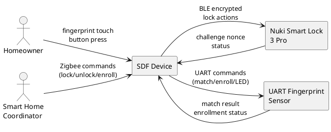

| Partner | Inputs | Outputs |
|---|---|---|
| Homeowner / User | Fingerprint touch, button press | LED feedback (color/pattern) |
| Smart Home Coordinator | Zigbee Lock/Unlock/Programming commands | Lock State, Battery %, Alarm Mask, User List |
| Nuki Smart Lock | Challenge nonce, status reports | — |
| UART Fingerprint Sensor | Match result, enrollment ACK, user query | Match/enroll/delete commands, LED control |

## 3.2 Technical Context

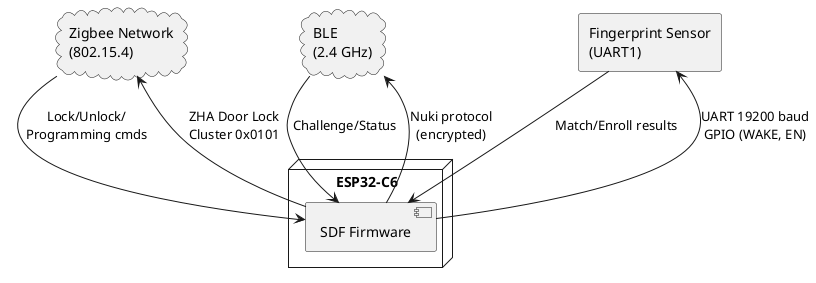

| Channel | Protocol | Mapping |
|---|---|---|
| Zigbee 802.15.4 | ZHA Door Lock Cluster 0x0101 | Lock/Unlock commands → internal events; attributes → reports |
| BLE (NimBLE) | Nuki Smart Lock protocol | Encrypted 0x000D Lock Action; challenge-response pairing |
| UART (GPIO 0/1) | Proprietary fingerprint protocol | 1:N match, 3-step enrollment, user query, LED control |
| GPIO 3 (WAKE) | Interrupt on touch | Wake from deep sleep on fingerprint touch |
| GPIO 2 (EN) | Power gate | Enable/disable fingerprint sensor power |
| GPIO 8 (WS2812) | LED ring | Status feedback: color, pulse, breathing patterns |

---

# 4. Solution Strategy

| Decision | Rationale |
|---|---|
| **Component-based ESP-IDF architecture** | Each module is an ESP-IDF component with `include/` + `src/`; enables independent compilation and testing via `test_runner` |
| **Event-driven FreeRTOS tasks** | Single `sdf_fp` task handles fingerprint polling, enrollment, and admin auth; power manager task handles sleep/wake; Zigbee callback-driven |
| **State machine pattern for enrollment** | `sdf_enrollment_sm` decouples enrollment logic from hardware; step results fed back via `apply_step_result()` |
| **Callback-based decoupling** | `sdf_app` registers callbacks with `sdf_services` for unlock, enrollment, and admin actions — no circular dependencies |
| **NimBLE Central with on-demand BLE** | BLE radio is gated to save power; only enabled during active lock actions or pairing |
| **Sensor-side template storage** | Fingerprint templates never leave the sensor; ESP32 only stores User ID ↔ permission mapping |
| **NVS for credential persistence** | Nuki authorization_id + shared_key, BLE target address, and security policy stored in encrypted NVS |
| **Layered component model** | Hardware abstraction → Drivers → Services → Protocol Adaptors → Application Logic |

---

# 5. Building Block View

## 5.1 Whitebox Overall System

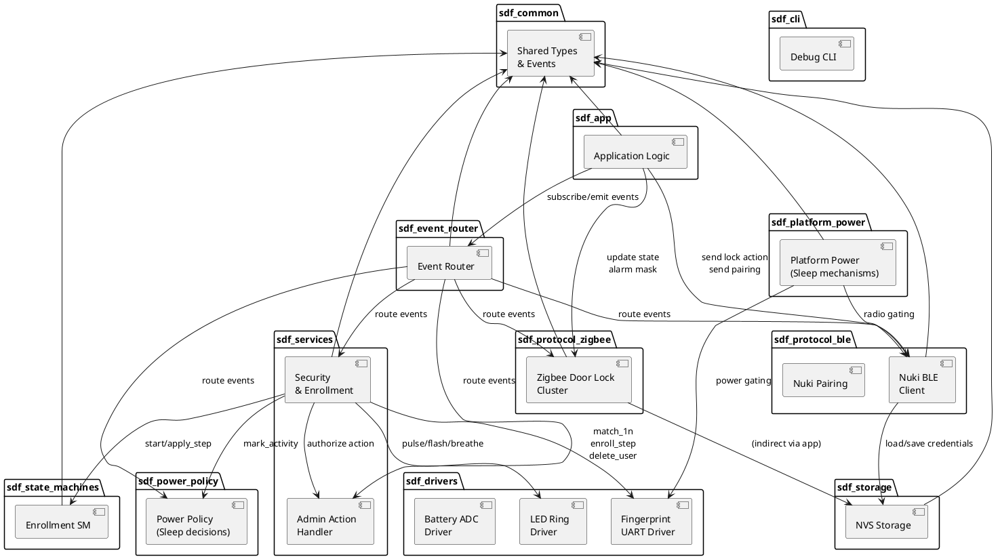

### Contained Building Blocks

| Component | Responsibility |
|---|---|
| **sdf_app** | Application orchestration: biometric unlock flow, Zigbee bridge flow, Nuki pairing flow, enrollment trigger, lock action queuing, event subscription, audit event emission |
| **sdf_services** | Core services: fingerprint match polling cycle, enrollment executor (event-driven, retries), admin action authorization (10s timeout), security rate limiting, LED feedback dispatch, event emission for biometric/security/enrollment events |
| **sdf_event_router** | Central event bus: typed event emission, priority-based dispatch (CRITICAL/HIGH/NORMAL/LOW), subscription management with filtering, audit logging |
| **sdf_protocol_ble** | BLE/Nuki protocol: encrypted/unencrypted message framing, Curve25519 ECDH key exchange, challenge-response, lock action encoding, nonce replay detection, event emission for lock actions |
| **sdf_protocol_zigbee** | Zigbee Door Lock Cluster (0x0101): command reception (Lock/Unlock/Latch/Programming), attribute reporting (Lock State, Battery, Alarm Mask, User List), event emission for Zigbee commands |
| **sdf_drivers** | Hardware abstraction: fingerprint UART (19200 baud, command framing, checksum), WS2812 LED ring (color animations), battery ADC |
| **sdf_state_machines** | Pure logic enrollment state machine (self-contained retry policy): IDLE → STEP_1 → STEP_2 → STEP_3 → SUCCESS/ERROR; exposes `next_action` API for executor |
| **sdf_storage** | NVS persistence: Nuki credentials, BLE target address, NVS security verification |
| **sdf_power_policy** | Portable sleep/wake policy: evaluates sleep conditions, manages wake guard timing, battery report scheduling, policy callbacks (busy, wake, battery, zigbee_ready); uses real-time timestamps via `esp_timer_get_time()` instead of mock values |
| **sdf_platform_power** | Platform-specific sleep mechanisms: ESP-IDF light/deep sleep entry, GPIO wake configuration, timer wake setup, BLE radio gating, RTC retention memory |
| **sdf_common** | Shared types: lock action enums, keyturner state, event/audit structs, error codes |
| **sdf_cli** | Debug CLI for interactive testing and diagnostics |

## 5.2 Level 2 — sdf_services (White Box)

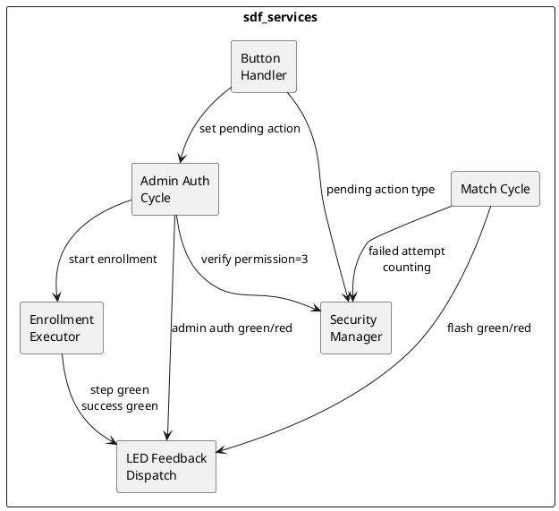

**Match Cycle:** Polls `fp_match_1n()` every 400ms in dedicated `sdf_match_task` (prio 5). On match, checks for pending admin action first; if none, emits `BIOMETRIC_MATCH` (HIGH). On failure, increments failed attempt counter and triggers lockout after threshold.

**Enrollment Executor:** Runs in dedicated `sdf_enroll_task` (prio 4). Calls `sdf_enrollment_sm_apply_step_result()` after each driver result to get the next action (`EXECUTE_STEP`, `RETRY_STEP`, `COMPLETE`, `FAIL`). Executes the returned action via `fp_enroll_step()` or LED feedback. All retry policy is encapsulated in `sdf_enrollment_sm`; the executor has no retry logic.

**Admin Auth Cycle:** Runs in dedicated `sdf_admin_task` (prio 5). After button press, waits for fingerprint match with `permission == 3`. On match, claims pending action and executes. On non-admin match, flashes red.

**Button Handler:** Taskless driver (`iot_button` with power-save). GPIO interrupt wakes timer debounce, detecting gestures (single/double/triple/long). Emits `BUTTON_PRESS` events to `sdf_admin_task` to map to admin actions.

**Security Manager:** Tracks failed attempts within configurable window (default: 5 in 60s). Triggers lockout (default: 120s) and emits Zigbee alarm bits.

## 5.3 Level 2 — sdf_app (White Box)

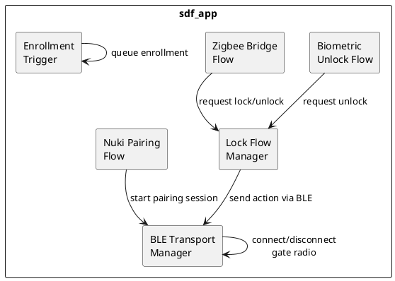

**Lock Flow Manager:** Implements a challenge-response state machine for Nuki lock actions. Sends challenge request, receives nonce, computes authenticator, sends lock action, handles status/error responses. Supports retry with configurable max (default: 2).

**BLE Transport Manager:** Gates the NimBLE radio to save power. Enables BLE on-demand for lock actions or pairing; disables after keyturner state synchronization.

## 5.4 Level 2 — sdf_protocol_ble (White Box)

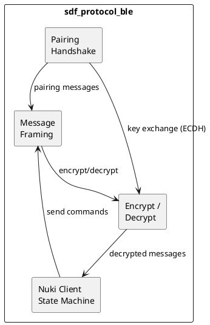

**Message Framing:** Handles Nuki protocol framing: command IDs, payload encoding/decoding, length fields, CRC validation.

**Crypto:** Curve25519 ECDH shared key computation, HMAC-SHA256 authenticator generation, libsodium secretbox encrypt/decrypt, nonce replay detection with bounded cache.

---

# 6. Runtime View

## 6.1 FreeRTOS Task Architecture

The following table documents the canonical FreeRTOS task architecture for SDF v2.0. This is the single source of truth for task priorities, stacks, triggers, and ownership. See `doc/rtos_tasks.md` for full specifications.

| Task | Priority | Stack | Core | Trigger | Comm | Owner |
|------|----------|-------|------|---------|------|-------|
| sdf_power | 4 (NORMAL) | 4 KB | 0 | Timer (250ms) | Events | sdf_power |
| sdf_zigbee | 5 (HIGH) | 8 KB | 0 | Event queue | Callbacks + Events | sdf_protocol_zigbee |
| sdf_match | 5 (HIGH) | 6 KB | 0 | 400ms poll | Events | sdf_services |
| sdf_enroll | 4 (NORMAL) | 4 KB | 0 | Event-driven | Events | sdf_services |
| sdf_admin | 5 (HIGH) | 4 KB | 0 | Event-driven | Events | sdf_services |
| sdf_ota (future) | 3 (LOW) | 8 KB | 0 | Event-driven | Events | sdf_ota |

**Total RAM (stacks):** ~34 KB + overhead

**Priority Mapping:**
- CRITICAL (6): `SECURITY_LOCKOUT_ENTERED`, `BIOMETRIC_MATCH` (admin)
- HIGH (5): `BIOMETRIC_MATCH` (user), `ZIGBEE_COMMAND`, `ADMIN_ACTION_REQUEST`
- NORMAL (4): `ENROLLMENT_START`, `POWER_SLEEP/WAKE`
- LOW (3): `BATTERY_REPORT`, `OTA_PROGRESS`

**Queue Depths:**
- sdf_match: 16 (drop oldest)
- sdf_enroll: 8 (block)
- sdf_admin: 8 (drop)
- sdf_zigbee: 32 (block)
- sdf_power: 8 (drop)

## 6.2 Biometric Unlock Flow

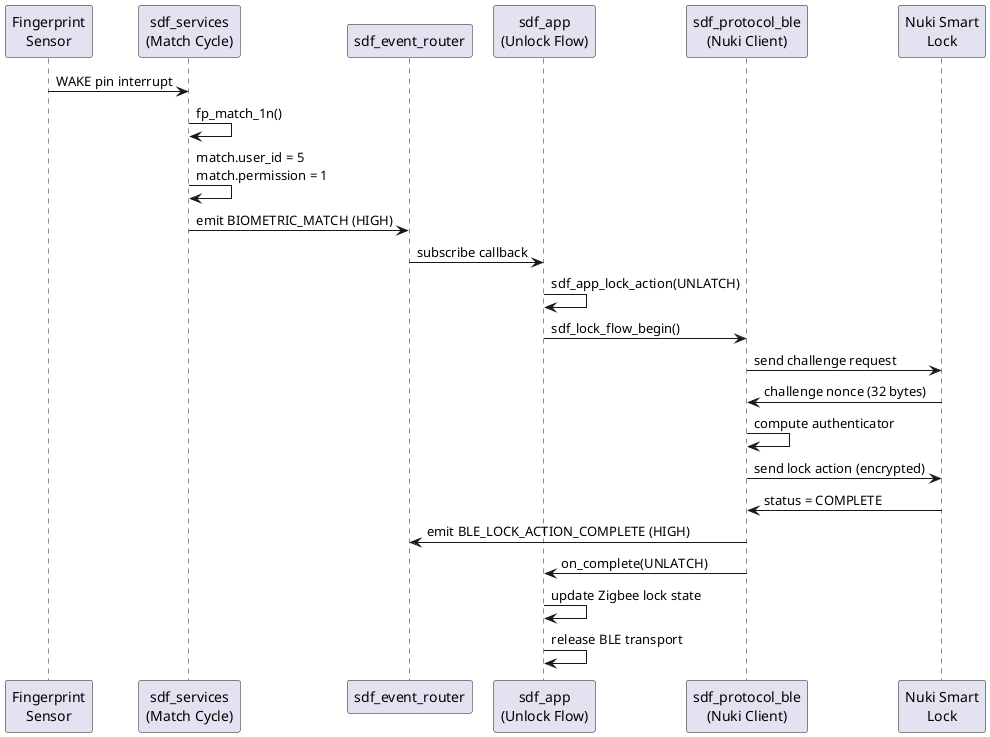

## 6.1.1 Event Router Processing

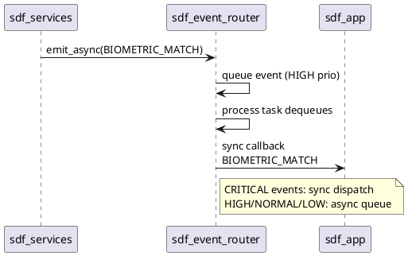

## 6.2 Zigbee Remote Unlock Flow

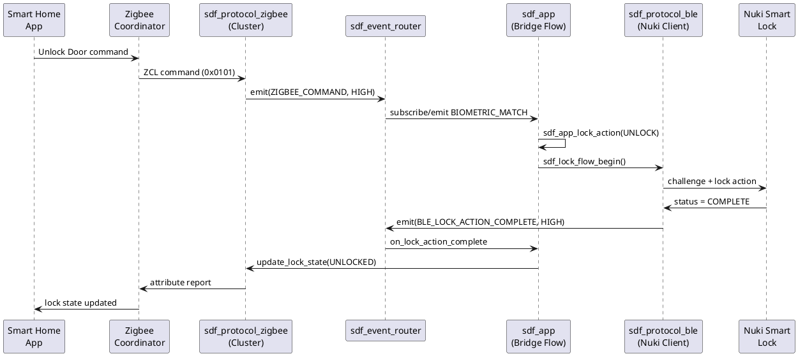

## 6.3 Enrollment Flow (Local)

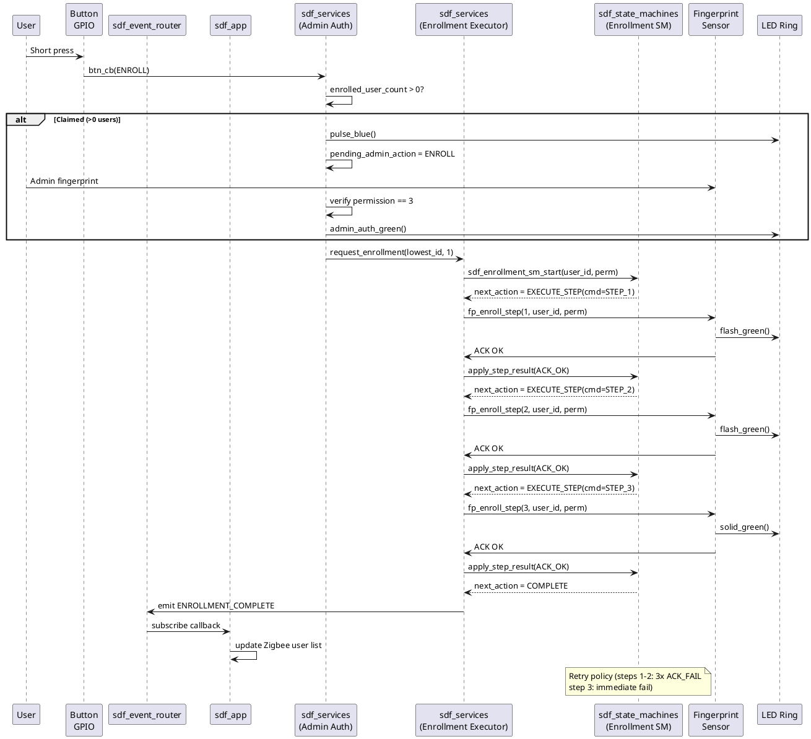

**Event-driven enrollment:** The `sdf_enrollment_sm` in `sdf_state_machines` is the single source of truth for enrollment state and retry logic. The `sdf_services` enrollment executor is a thin driver that:
1. Starts the SM on enrollment request
2. After each driver result, calls `apply_step_result()` to get the next action
3. Executes the returned action (driver call, LED, or event emission)
4. On COMPLETE/FAIL, emits `ENROLLMENT_COMPLETE` / `ENROLLMENT_FAILED` events via event router

This replaces the old callback-based design where `sdf_app` subscribed to `enrollment_cb` in `sdf_services_config_t`. Now `sdf_app` subscribes to `ENROLLMENT_COMPLETE` and `ENROLLMENT_FAILED` events from the event router.

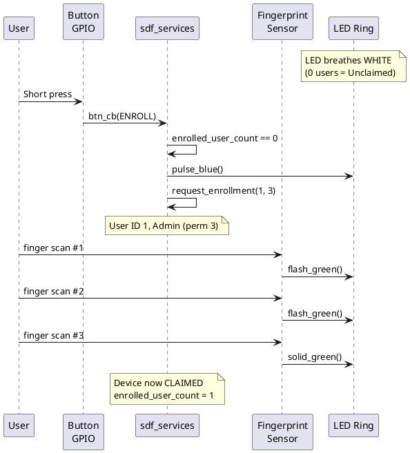

## 6.5 Power Management State Machine

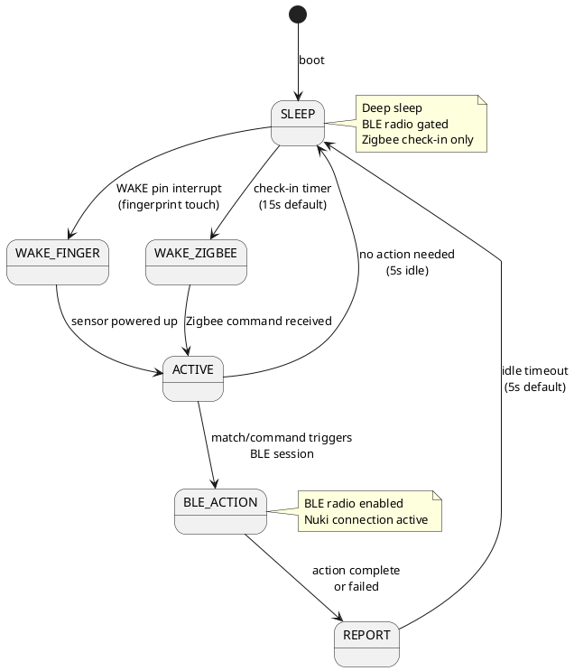

---

# 7. Deployment View

## 7.1 Infrastructure Level 1

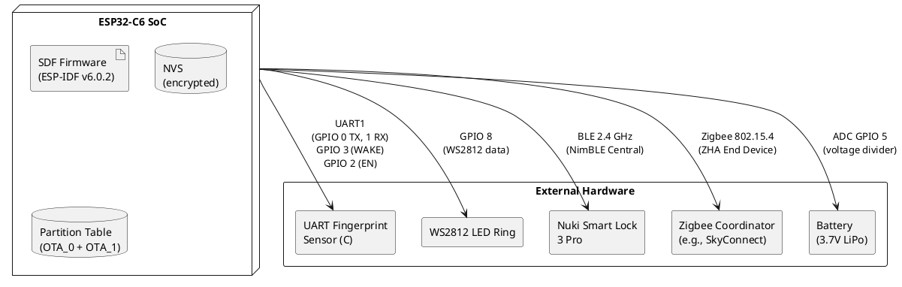

### Flash Layout

| Partition | Offset | Size | Purpose |
|---|---|---|---|
| nvs | 0x9000 | 24 KB | NVS data (credentials, config) |
| phy_init | 0xF000 | 4 KB | PHY calibration data |
| otadata | 0x10000 | 8 KB | OTA swap state |
| nvs_keys | 0x12000 | 4 KB | NVS encryption keys |
| ota_0 | 0x20000 | ~1.9 MB | Firmware slot A |
| ota_1 | 0x210000 | ~1.9 MB | Firmware slot B |
| zb_storage | 0x3FB000 | 16 KB | Zigbee persistent storage |
| zb_fct | 0x3FF000 | 4 KB | Zigbee factory data |

---

# 8. Cross-cutting Concepts

## 8.1 Security

### Biometric Rate Limiting
- **Threshold:** 5 failed attempts within 60s → 120s lockout
- **Implementation:** `sdf_services` tracks `failed_attempt_count` and `failed_attempt_window_start_us`
- **Zigbee alarm bit:** `0x0004` (BIOMETRIC_LOCKOUT) set on lockout, cleared when lockout expires

### Nonce Replay Protection
- Bounded cache of recently seen nonces (default window: 8 entries)
- Duplicate nonces rejected with `SDF_NUKI_RESULT_ERR_NONCE_REUSE`
- Zigbee alarm bit: `0x0008` (SECURITY_PROTOCOL)

### Encrypted NVS
- NVS encryption enabled via `CONFIG_NVS_ENCRYPTION=y`
- `nvs_keys` partition required for HMAC-based encryption
- Boot-time verification: `sdf_storage_get_security_status()` checks encryption policy

### BLE Transport Security
- Curve25519 ECDH key exchange during pairing
- HMAC-SHA256 authenticator for authorization data
- libsodium secretbox (XSalsa20-Poly1305) for encrypted frames

### BLE Companion Authentication Wire Format

`sdf_ble_companion` gates the Config, Enrollment and OTA characteristics behind a LOGIN on the Auth characteristic. LOGIN is a two-round-trip challenge-response: `LOGIN_INIT` writes a username, the client then *reads* the characteristic to collect `[salt(16)][iteration_count(4, little-endian)][nonce(16)]`, and `LOGIN_VERIFY` writes the computed response.

Every command has an exact length. A write longer than 65 bytes — the largest well-formed command, `REGISTER` with a maximum-length username — is rejected with `BLE_ATT_ERR_INVALID_ATTR_VALUE_LEN` before it is copied or dispatched on. Usernames are at most `SDF_STORAGE_WEB_USER_NAME_MAX - 1` (31) bytes on the wire.

| Command | Opcode | Layout | Accepted length |
|---|---|---|---|
| `LOGOUT` | `0x00` | `[cmd]` | exactly 1 |
| *(unassigned)* | `0x01` | — | rejected (retired single-message LOGIN) |
| `REGISTER` | `0x02` | `[cmd][name_len][name][password_hash(32)]` | `2 + name_len + 32`, `1 <= name_len <= 31` |
| `LOGIN_INIT` | `0x03` | `[cmd][name_len][name]` | `2 + name_len`, `1 <= name_len <= 31` |
| `LOGIN_VERIFY` | `0x04` | `[cmd][response(32)]` | exactly 33 |

Any other opcode is rejected with `BLE_ATT_ERR_WRITE_NOT_PERMITTED`. `LOGOUT` carries no operands, so a padded `LOGOUT` is an invalid-length error and does **not** log the connection out.

### BLE Companion GATT Write Staging

A GATT access callback must hand an inbound payload to an application callback *after* releasing the component lock — callbacks may re-enter `sdf_ble_companion`, so they never run under it. The payload therefore needs storage outliving the locked region, and it cannot be a 512-byte stack frame: every GATT access callback runs on the NimBLE host task (`CONFIG_BT_NIMBLE_HOST_TASK_STACK_SIZE` = 4096).

`sdf_ble_companion_gatt_scratch` owns that storage and enforces single ownership rather than assuming it:

- **`bind_owner()`** records the calling task, once, from the host-sync hook before advertising starts. Re-binding from the same task (NimBLE resync) is a no-op; from another task it is refused.
- **`acquire()`** returns the buffer only to the owning task, and only when it is not already held; otherwise `NULL`.
- **`release()`** is idempotent, so error paths may release unconditionally; a non-owner release is refused and leaves the buffer held.
- **`violation_count()`** counts refusals. A refusal is a contract violation, not a client error: it is logged at error level, fails only the triggering GATT operation with an ATT error, and never aborts the device.

The Auth characteristic does not use this module — nothing it reads survives the lock release, so it stages into a 65-byte stack buffer instead. Config, Enrollment and OTA writes share a single staging helper, so `acquire()` and `release()` each appear exactly once in the component.

## 8.2 Power Management

Power management is split into two components for separation of concerns:

| Component | Responsibility |
|---|---|
| **sdf_power_policy** | Sleep/wake decisions, wake guard timing, battery report scheduling, policy callbacks; uses real-time timestamps via `esp_timer_get_time()` (previously used mock `1000000000` values) |
| **sdf_platform_power** | ESP-IDF sleep entry, GPIO wake configuration, timer wake setup, BLE radio gating, RTC retention |

| Parameter | Default | Config Key |
|---|---|---|
| Zigbee check-in interval | 15s | `CONFIG_SDF_POWER_CHECKIN_INTERVAL_MS` |
| Idle before sleep | 5s | `CONFIG_SDF_POWER_IDLE_BEFORE_SLEEP_MS` |
| Post-wake guard | 1.5s | `CONFIG_SDF_POWER_POST_WAKE_GUARD_MS` |
| Power loop interval | 250ms | `CONFIG_SDF_POWER_LOOP_INTERVAL_MS` |
| Battery report interval | 60s | `CONFIG_SDF_POWER_BATTERY_REPORT_INTERVAL_MS` |
| Light sleep | enabled | `CONFIG_SDF_POWER_ENABLE_LIGHT_SLEEP` |
| BLE radio gating | enabled | `CONFIG_SDF_POWER_ENABLE_BLE_RADIO_GATING` |
| Adaptive check-in | enabled | `CONFIG_SDF_POWER_ADAPTIVE_CHECKIN` |
| Deep sleep min duration | 30s | `CONFIG_SDF_POWER_DEEP_SLEEP_MIN_MS` |

**Wake sources:** 
- Timer (Zigbee check-in): `CONFIG_SDF_POWER_WAKE_SOURCE_TIMER`
- Fingerprint GPIO (GPIO 3): `CONFIG_SDF_POWER_WAKE_SOURCE_FINGERPRINT`
- USB connection detect: `CONFIG_SDF_POWER_WAKE_SOURCE_USB`
- BLE activity (experimental): `CONFIG_SDF_POWER_WAKE_SOURCE_BLE`
- Zigbee RX (radio IRQ): `CONFIG_SDF_POWER_WAKE_SOURCE_ZIGBEE`
- Enrollment button: `CONFIG_SDF_POWER_WAKE_SOURCE_BUTTON`

**RTC Retention Memory:** Preserves fast-resume state across deep sleep (magic, BLE/Zigbee state, battery, security counters, timestamps). CRC16-validated. Size: `CONFIG_SDF_POWER_RETENTION_SIZE` (default 256 bytes).

**Staged Wake Sequence:**
1. **Critical**: Restore NVS security context, re-enable interrupts, start TWDT
2. **Fast Path** (fingerprint/BLE wake): Power on sensor, enable BLE radio, skip Zigbee init
3. **Full Path** (timer/Zigbee wake): Init Zigbee stack, process commands, update attributes
4. **Housekeeping**: Battery ADC, sensor calibration check, NVS sync

**Adaptive Check-in Interval:** Scales base interval (15s) by battery: <20% → 4x (60s), <40% → 2x (30s), <60% → 1.5x (22s), else base.

**Sleep behavior:** Deep sleep with configurable wake sources. BLE radio disabled when idle. Fingerprint sensor powered off between match cycles. LED off during sleep. Retention state enables <100ms unlock from fingerprint wake.

## 8.3 Error Handling

| Error Source | Strategy |
|---|---|
| BLE connection failure | Retry up to 2x with backoff; report `UNKNOWN` lock state on Zigbee |
| BLE encrypted frame invalid | Reject frame; retry lock action if in progress |
| Fingerprint UART timeout | 12s timeout; skip match cycle; retry next poll |
| Enrollment step ACK_FAIL (step 1-2) | Retry same step (user likely didn't lift finger) |
| Enrollment step ACK_FAIL (step 3) | Fail enrollment (templates incompatible) |
| Zigbee command failure | Report alarm bit; do not block future commands |
| NVS credential load fail | Start with empty credentials; wait for Admin pairing |
| Watchdog (TWDT 15s) | Panic reset; recovers from stalled tasks |

## 8.4 Observability

- **ESP_LOG** at configurable levels (DEBUG=4, INFO=3, WARN=2)
- **Audit events** via `sdf_event_router_emit()` with `SDF_EVENT_ROUTER_AUDIT`: biometric match/fail/lockout, nonce replay, protocol error, pairing complete/failed, OTA triggered/started/verifying/committed/rolled back/failed, OTA signature invalid/missing, OTA version upgrade/downgrade
- **Zigbee alarm mask** bits: `0x0001` (ACTION_FAILURE), `0x0002` (LOW_BATTERY), `0x0004` (BIOMETRIC_LOCKOUT), `0x0008` (SECURITY_PROTOCOL)
- **Diagnostic counters** in `sdf_app`: `s_app_audit_err_biometric_failed`, `s_app_audit_err_auth_lockout`, `s_app_audit_err_nonce_replay`, `s_app_audit_err_protocol`
- **Event Router**: Central event bus for all cross-component communication with priority-based dispatch and built-in audit logging

---

# 9. Architecture Decisions

The `sdf_event_router` component provides a central event bus that decouples components through typed events with priority-based dispatch.

### Features
- **Event types**: Biometric match/fail, Zigbee commands, BLE lock actions, Power sleep/wake, Security lockout, Admin actions, Enrollment steps
- **Priority levels**: CRITICAL (security), HIGH (lock actions), NORMAL (enrollment), LOW (telemetry)
- **Dispatch modes**: Synchronous (CRITICAL), Asynchronous via FreeRTOS queue (other priorities)
- **Subscription**: Component-level with event type and minimum priority filters, backed by a static capacity pool frozen at `sdf_event_router_start()` with lock-free dispatch
- **Audit logging**: All events automatically logged when `CONFIG_SDF_EVENT_ROUTER_ENABLE_AUDIT` is enabled

### Migration from Callbacks
Previously, `sdf_app` registered direct callbacks with `sdf_services` (`unlock_cb`, `enrollment_cb`). The event router replaces this with:
1. `sdf_services` emits typed events via `sdf_event_router_emit()`
2. `sdf_app` subscribes to relevant events at init
3. Zigbee, BLE, and Power components emit their own events
4. All cross-component communication routes through the event bus

### Event Structure
```c
typedef struct {
    sdf_event_router_type_t type;      // Event category
    sdf_event_router_priority_t priority;  // Processing priority
    uint32_t timestamp_ms;             // Event timestamp
    union {
        sdf_event_router_biometric_payload_t biometric;
        sdf_event_router_zigbee_payload_t zigbee;
        sdf_event_router_ble_payload_t ble;
        sdf_event_router_power_payload_t power;
        sdf_event_router_security_payload_t security;
        sdf_event_router_admin_payload_t admin;
        sdf_event_router_enrollment_payload_t enrollment;
    } payload;
} sdf_event_router_event_t;
```

---

## 8.2 OTA Update Mechanism

The OTA update mechanism is implemented in the `sdf_ota` component and provides:

### Trigger Paths
- **Zigbee OTA** (existing, enhanced): Coordinator pushes image via Zigbee OTA cluster; device delegates to `sdf_ota` for version check, signature verification, and commit
- **CLI**: `ota trigger zigbee://` initiates immediate Zigbee OTA query; future paths for HTTP/BLE planned
- **BLE Peripheral** (architecture only): Future GATT service for smartphone-initiated updates

### Version Management
- Semantic version from git tags: `v<major>.<minor>.<patch>[-<commit-count>-g<short-hash>]`
- Embedded at build time via CMake (`git describe --tags --always --dirty`)
- Accessible at runtime via `sdf_ota_get_version()` and `esp_app_get_description()->version`
- Comparison: major.minor.patch numerically; pre-release suffixes compare lower than release

### Signature Verification
- Ed25519 (mandatory, enforced by `CONFIG_SDF_OTA_SIGNATURE_VERIFY=y`)
- Public key (32 bytes) embedded in firmware `.rodata`
- Private key held offline; images signed with `tools/sdf_sign_ota.py` (appends 64-byte signature + 4-byte magic `SDF\x01`)
- Verification happens in app before `esp_ota_end()`; bootloader does NOT verify

### Rollback
- **Automatic**: Bootloader rollback enabled (`CONFIG_BOOTLOADER_APP_ROLLBACK_ENABLE=y`); on boot failure (WDT, crash loop) reverts to previous partition
- **Manual**: CLI `ota rollback` → `esp_ota_mark_app_invalid_rollback_and_reboot()`

### Zigbee Integration
- Query interval configurable via `CONFIG_SDF_OTA_ZIGBEE_QUERY_INTERVAL_HOURS` (default 24h)
- Progress reporting to coordinator via `esp_zb_ota_upgrade_client_progress_report()` during download
- Manufacturer code: 0x1011, Image type: 0x1111

### Audit Events
All OTA lifecycle events emitted via `sdf_app` audit callback:
`OTA_TRIGGERED`, `OTA_STARTED`, `OTA_VERIFYING`, `OTA_COMMITTED`, `OTA_ROLLED_BACK`, `OTA_FAILED`, `OTA_SIGNATURE_INVALID`, `OTA_SIGNATURE_MISSING`, `OTA_VERSION_DOWNGRADE`, `OTA_VERSION_UPGRADE`

### Partition Table
Dual OTA slots (ota_0, ota_1) + otadata for swap state; nvs_keys for encrypted NVS.

---

# 9. Architecture Decisions

| ADR | Decision | Rationale |
|---|---|---|
| ADR-1 | **ESP-IDF components for module boundaries** | Each component has `include/` + `src/`; enables `test_runner` to link all components and run Unity tests on hardware |
| ADR-2 | **Single FreeRTOS task for fingerprint services** | `sdf_fp` task handles match polling, enrollment, and admin auth; avoids complex inter-task synchronization for sensor access |
| ADR-3 | **Callback-based decoupling over direct calls** | `sdf_app` registers callbacks with `sdf_services`; enables test mocking and prevents circular dependencies |
| ADR-4 | **Sensor-side template storage** | Fingerprint templates never leave the sensor; ESP32 only maps User ID ↔ permission; reduces firmware complexity and security surface |
| ADR-5 | **On-demand BLE connections** | BLE radio gated to save power; only enabled during lock actions or pairing; disconnects after keyturner state sync |
| ADR-6 | **All-zero BLE target address for discovery** | `SDF_NUKI_TARGET_ADDR` defaults to `{0x00,...}` which triggers advertisement-based Nuki discovery during pairing; allows pairing without pre-configuring the lock address |
| ADR-7 | **Custom partition table with NVS keys** | Required for encrypted NVS; `nvs_keys` partition stores HMAC key for encryption |
| ADR-8 | **State machine pattern for enrollment** | Decouples enrollment logic from hardware timing; `apply_step_result()` allows synchronous advancement from async UART responses |
| ADR-9 | **Central event router for cross-component communication** | Replaces direct callback chains with typed event bus; supports priority ordering (CRITICAL/HIGH/NORMAL/LOW), audit logging, and decoupled async dispatch; enables observability and testability |

---

# 10. Quality Requirements

## 10.1 Quality Requirements Overview

| Category | Requirement | Measurement |
|---|---|---|
| **Performance** | Local biometric unlock latency | < 2s from touch to Nuki unlock |
| **Performance** | Remote unlock latency | < 1 check-in interval (15s default) |
| **Reliability** | Fingerprint sensor availability | Sensor responds to probe on boot |
| **Reliability** | BLE session success rate | > 95% of lock actions complete without retry |
| **Security** | Biometric data isolation | Templates stored only in sensor flash |
| **Security** | Replay protection | Nonce cache prevents reuse |
| **Usability** | Enrollment guidance | LED provides clear feedback for each step |
| **Maintainability** | Component boundaries | Each component independently compilable and testable |
| **Portability** | ESP-IDF version lock | Pinned to v6.0.2; ESP-IDF API compatibility |

## 10.2 Quality Scenarios

**QS-1: Local biometric unlock under normal conditions**
- *Stimulus:* User touches fingerprint sensor with enrolled finger
- *Response:* Nuki lock unlocks within 2 seconds
- *Metric:* Touch-to-unlock latency < 2000ms

**QS-2: Remote unlock with Zigbee coordinator**
- *Stimulus:* Home Assistant sends "Unlock Door" via Zigbee
- *Response:* Nuki lock unlocks within one check-in interval
- *Metric:* End-to-end latency < 15s (default check-in)

**QS-3: Brute-force resistance**
- *Stimulus:* 5 consecutive failed fingerprint attempts within 60 seconds
- *Response:* Device enters 120s lockout; Zigbee alarm bit set
- *Metric:* Lockout begins within 1 second of 5th failure

**QS-4: Power consumption**
- *Stimulus:* Device idle with Zigbee check-in every 15s
- *Response:* Average current consumption < 50 µA
- *Metric:* Battery life > 6 months on 1000mAh battery

**QS-5: First-time setup without Zigbee**
- *Stimulus:* New device powered on; user presses button once
- *Response:* Admin enrollment completes; device can unlock door with fingerprint
- *Metric:* Setup completes without Zigbee coordinator

---

# 11. Risks and Technical Debts

| Risk / Debt | Priority | Mitigation |
|---|---|---|
| **No CI/CD pipeline** | High | Tests require hardware; no host-based test runner yet |
| **Placeholder BLE address** | High | `SDF_NUKI_TARGET_ADDR` must be set to real lock address before pairing |
| **Fingerprint LED command tuning** | Medium | `Control LED (0x3C)` payload bytes are module-variant specific; defaults may need hardware calibration |
| **Factory reset incomplete** | Resolved | Complete factory reset implemented (NVS erase, template deletion, Zigbee reset, services state clear, CLI `factory_reset YES`) |
| **Memory safety in hot paths** | Resolved | Replaced `calloc()` in enrollment and permission change paths with static pre-allocated buffers; added `esp_get_free_heap_size()` OOM guard with audit event emission |
| **Power policy migration in progress** | Medium | `sdf_power` being refactored to `sdf_power_policy` + `sdf_platform_power`; test on hardware before full deployment |
| **Zigbee check-in latency trade-off** | Low | 15s default balances battery life vs. remote command responsiveness |
| **`sdf_platform` and `sdf_config` components implemented** | Low | Components now exist providing HAL wrappers and centralized configuration management |

---

# 12. Glossary

| Term | Definition |
|---|---|
| SDF | Smart Door Finger — the biometrics bridge device |
| Nuki Smart Lock 3 Pro | BLE-controlled smart lock that receives lock/unlock commands |
| ZHA | Zigbee Home Automation — the Zigbee profile used by Home Assistant |
| Door Lock Cluster (0x0101) | Zigbee cluster defining lock/unlock commands and attributes |
| NimBLE | BLE stack used by ESP-IDF (vs. Bluedroid) |
| TWT | Target Wake Time — Zigbee sleepy end device scheduling mechanism |
| Enrollment | Process of capturing a fingerprint template (3-touch) and mapping it to a User ID |
| Claimed | Device state after first Admin user is enrolled (enrolled_user_count > 0) |
| Unclaimed | Device state with 0 enrolled users; LED breathes white |
| Lock Flow | Challenge-response state machine for sending lock actions to Nuki |
| Admin Action | Configuration action (enroll, pair, join, reset) requiring Admin fingerprint authorization |
| Nonce | Random number used once in cryptographic challenge-response |
| NVS | Non-Volatile Storage — ESP-IDF key-value persistence layer |
